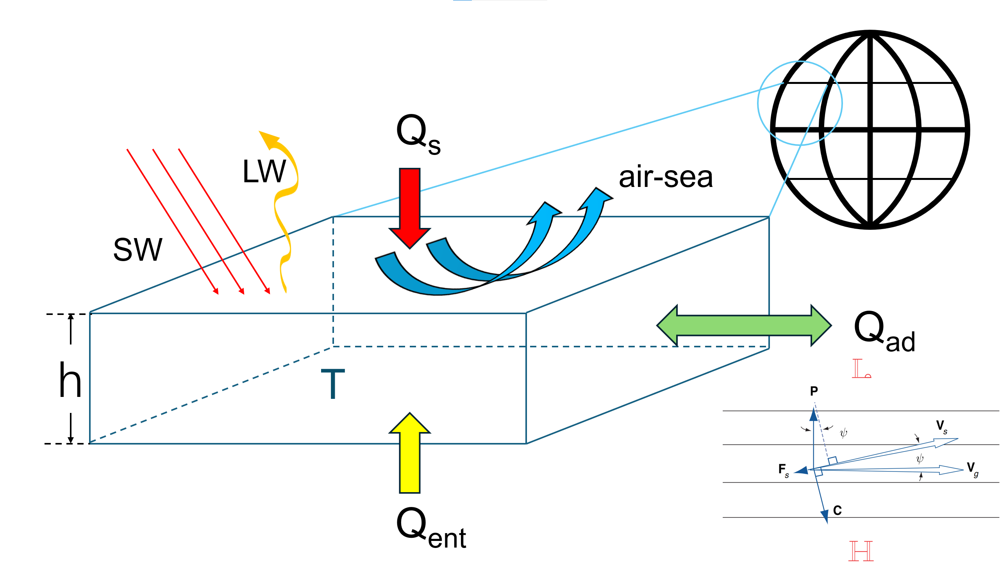
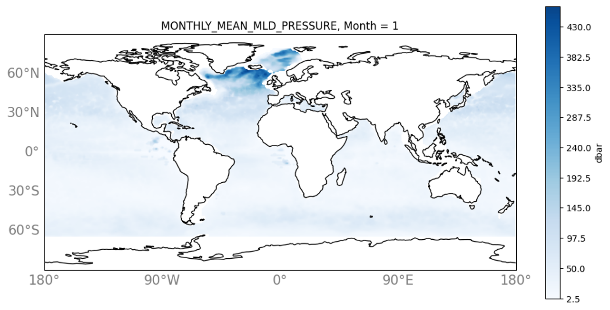

# SSTA
Sea Surface Temperature Anomalies - slab mixed layer model

MSci Project - Imperial College London, SPC-Czaja-1

### Authors: Chengyun Zhu, Christopher O'Sullivan, Jason Yiya, Xizhe Xie

Shield: [![CC BY-NC-SA 4.0][cc-by-nc-sa-shield]][cc-by-nc-sa]

This work is licensed under a
[Creative Commons Attribution-NonCommercial-ShareAlike 4.0 International License][cc-by-nc-sa].

[![CC BY-NC-SA 4.0][cc-by-nc-sa-image]][cc-by-nc-sa]

[cc-by-nc-sa]: http://creativecommons.org/licenses/by-nc-sa/4.0/
[cc-by-nc-sa-image]: https://licensebuttons.net/l/by-nc-sa/4.0/88x31.png
[cc-by-nc-sa-shield]: https://img.shields.io/badge/License-CC%20BY--NC--SA%204.0-lightgrey.svg

The Slab Mixed Layer Model:

Results for Monthly Mean Mixed Layer Depth ($\bar{h}$) from RG-ARGO climatology:

<video src="_readme_archive/hbar.mp4" loop="loop" controls preload></video>

Sea Surface Temperature Anomaly (SSTA):
Observed: Reynolds SSTA (LTM 2005-2025), Simulated: RGARGO mixed layer TA (LTM 2005-2025)

Sea Surface Salinity Anomaly (SSSA):
Observed: RGARGO mixed layer SA (LTM 2005-2025), Simulated: RGARGO mixed layer SA (LTM 2005-2025)

